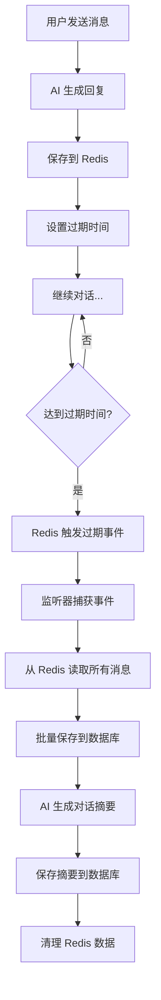
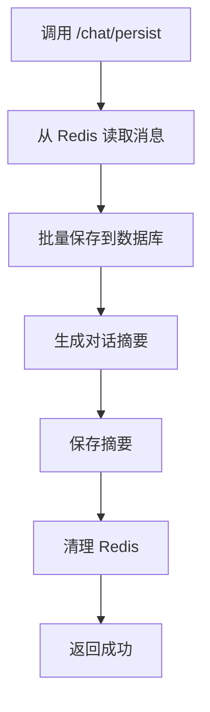

# Redis 聊天记录过期管理配置文档

## 功能概述

本系统实现了基于 Redis 的聊天记录自动过期和持久化机制：

1. **聊天记录临时存储**: 对话消息先保存到 Redis，设置过期时间
2. **自动触发持久化**: Redis 键过期时自动触发批量持久化到数据库
3. **智能摘要生成**: 使用 AI 自动生成对话摘要
4. **手动持久化**: 支持主动触发持久化操作

---

## 配置步骤

### 1. Redis 配置

在 `application.yml` 或 `application.properties` 中添加 Redis 配置：

```yaml
spring:
  redis:
    host: localhost
    port: 6379
    password: # 如果有密码
    database: 0
    timeout: 3000ms
    lettuce:
      pool:
        max-active: 8
        max-idle: 8
        min-idle: 0
        max-wait: -1ms
```

### 2. 启用 Redis 键空间通知

**重要**: 必须在 Redis 服务器中启用键过期事件通知。

#### 方法 1: 修改 redis.conf
```conf
notify-keyspace-events Ex
```

#### 方法 2: 使用 Redis CLI
```bash
redis-cli config set notify-keyspace-events Ex
```

#### 方法 3: 在代码中自动配置（推荐）
在 `RedisConfig` 中添加：
```java
@PostConstruct
public void enableKeyspaceNotifications() {
    redisTemplate.execute((RedisCallback<Object>) connection -> {
        connection.setConfig("notify-keyspace-events", "Ex");
        return null;
    });
}
```

---

## 核心组件说明

### 1. RedisConfig
- 配置 RedisTemplate
- 配置消息监听容器
- 启用键空间通知

### 2. RedisKeyExpirationListener
- 监听 Redis 键过期事件
- 自动触发持久化流程

### 3. RedisChatService
- 保存聊天消息到 Redis
- 设置过期时间
- 批量持久化到数据库

### 4. ChatSummaryService
- 使用 AI 生成对话摘要
- 提供备用简单摘要方案

---

## API 接口使用

### 1. 聊天接口（自动保存到 Redis）

```http
GET /chat/push?message=你好&conversationId=conv-123&expireSeconds=3600
```

**参数说明**:
- `message` (必填): 用户消息
- `conversationId` (可选): 对话ID，不提供则自动生成
- `expireSeconds` (可选): 过期时间（秒），默认 3600（1小时）

**功能**:
- 与 AI 对话
- 自动保存消息到 Redis
- 设置过期时间
- 过期后自动持久化

---

### 2. 手动触发持久化

```http
POST /chat/persist?conversationId=conv-123
```

**参数说明**:
- `conversationId` (必填): 要持久化的对话ID

**功能**:
- 立即将 Redis 中的对话记录持久化到数据库
- 生成对话摘要
- 清理 Redis 数据

---

### 3. 直接保存到数据库（原有接口）

```http
POST /chat/record/save
Content-Type: application/x-www-form-urlencoded

conversationId=conv-123&userMessage=你好&botResponse=你好！
```

---

## 工作流程

### 自动持久化流程



### 手动持久化流程



---

## Redis 数据结构

### 聊天消息列表
```
Key: chat:conversation:{conversationId}
Type: List
Value: ChatMessage 对象列表
TTL: 无（由过期键控制）
```

### 过期触发键
```
Key: chat:expire:{conversationId}
Type: String
Value: conversationId
TTL: expireSeconds（用户设置）
```

**设计说明**: 
- 消息列表本身不设置 TTL
- 使用单独的过期键触发事件
- 过期时读取消息列表并持久化

---

## 配置建议

### 过期时间设置

| 场景 | 建议时间 | 说明 |
|------|---------|------|
| 短期对话 | 1800秒 (30分钟) | 快速对话，及时持久化 |
| 普通对话 | 3600秒 (1小时) | 默认设置 |
| 长期对话 | 7200秒 (2小时) | 深度讨论 |
| 测试环境 | 60秒 (1分钟) | 快速测试 |

### 性能优化

1. **批量操作**: 使用 Redis Pipeline 批量保存消息
2. **异步处理**: 持久化操作在后台异步执行
3. **错误重试**: 持久化失败时记录日志，可配置重试机制

---

## 监控和日志

系统会记录以下关键日志：

```
[INFO] 保存聊天消息到 Redis: conversationId=conv-123, 过期时间=3600秒
[INFO] 检测到 Redis 键过期: chat:expire:conv-123
[INFO] 触发对话记录持久化: conversationId=conv-123
[INFO] 批量保存聊天记录完成: conversationId=conv-123, 总数=10, 成功=10
[INFO] 保存对话概要: conversationId=conv-123, 成功=true
[INFO] 清理 Redis 数据: conversationId=conv-123
```

---

## 故障排查

### 问题 1: 过期事件未触发

**原因**: Redis 未启用键空间通知

**解决方案**:
```bash
redis-cli config get notify-keyspace-events
# 如果返回空或不包含 "Ex"，执行：
redis-cli config set notify-keyspace-events Ex
```

### 问题 2: 持久化失败

**检查项**:
1. 数据库连接是否正常
2. 表结构是否正确
3. 查看错误日志

### 问题 3: 摘要生成失败

**原因**: AI 服务不可用

**解决方案**: 系统会自动降级使用简单摘要

---

## 依赖要求

```xml
<dependencies>
    <!-- Spring Data Redis -->
    <dependency>
        <groupId>org.springframework.boot</groupId>
        <artifactId>spring-boot-starter-data-redis</artifactId>
    </dependency>
    
    <!-- Lettuce (Redis 客户端) -->
    <dependency>
        <groupId>io.lettuce</groupId>
        <artifactId>lettuce-core</artifactId>
    </dependency>
    
    <!-- Spring AI -->
    <dependency>
        <groupId>org.springframework.ai</groupId>
        <artifactId>spring-ai-core</artifactId>
    </dependency>
</dependencies>
```

---

## 测试示例

### 1. 基本对话测试
```bash
# 第一条消息
curl "http://localhost:8080/chat/push?message=你好&expireSeconds=60"

# 继续对话（使用返回的 conversationId）
curl "http://localhost:8080/chat/push?message=介绍一下Java&conversationId=xxx&expireSeconds=60"

# 等待 60 秒后，检查数据库是否自动保存
```

### 2. 手动持久化测试
```bash
# 发送几条消息
curl "http://localhost:8080/chat/push?message=测试1&conversationId=test-001"
curl "http://localhost:8080/chat/push?message=测试2&conversationId=test-001"

# 手动触发持久化
curl -X POST "http://localhost:8080/chat/persist?conversationId=test-001"
```

---

## 总结

✅ **自动化**: Redis 过期自动触发持久化  
✅ **智能化**: AI 自动生成对话摘要  
✅ **灵活性**: 支持手动触发持久化  
✅ **可靠性**: 错误处理和日志记录完善  
✅ **高性能**: Redis 缓存 + 批量操作  

系统已完整实现 Redis 聊天记录的过期管理和自动持久化功能！
